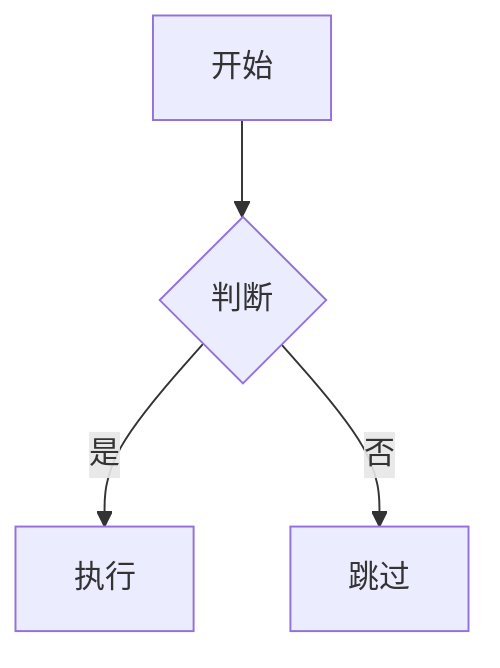

# Obsidian Markdown

## 文档定位

本 skill 处理的是 Obsidian 对 Markdown 的扩展能力。

它不重复讲普通 Markdown 基础语法，只覆盖这些 Obsidian 特有内容：

- wikilink
- embed
- callout
- properties / frontmatter
- tags
- comments

## 工作流

1. 先确定笔记要写成什么结构，再写正文。
2. 需要元数据时，把 properties 放在文件最上方。
3. Vault 内部引用优先用 wikilink。
4. 需要内嵌内容时用 embed，不要用普通链接冒充嵌入。
5. 重要说明用 callout，不要乱堆粗体和感叹号。
6. 写完后至少检查一次阅读视图是否正常渲染。

## 文件头：Properties

Properties 使用 YAML frontmatter，放在文件最开头：

```yaml
---
title: 我的笔记
date: 2024-01-15
tags:
  - 项目
  - 活跃
aliases:
  - 备用名称
cssclasses:
  - custom-class
---
```

默认常用字段：

- `tags`：标签
- `aliases`：别名
- `cssclasses`：自定义样式类

完整属性说明见 [references/PROPERTIES.md](references/PROPERTIES.md)。

## 内部链接：Wikilink

Vault 内笔记之间的链接优先使用 wikilink：

```markdown
[[笔记名]]
[[笔记名|显示文本]]
[[笔记名#标题]]
[[笔记名#^block-id]]
[[#当前笔记里的标题]]
```

规则：

- 链接 vault 内笔记时，优先用 `[[wikilink]]`。
- 链接外部网页时，才用 `[文本](url)`。
- block link 需要先在原文里定义 block ID。

## Block ID

给段落追加 block ID：

```markdown
这是一段可以被精确引用的内容。 ^my-block-id
```

给引用块或列表追加 block ID 时，单独占一行：

```markdown
> 这是一个引用块

^quote-id
```

## 嵌入：Embed

给 wikilink 前面加 `!` 就是嵌入：

```markdown
![[笔记名]]
![[笔记名#标题]]
![[image.png]]
![[image.png|300]]
![[document.pdf#page=3]]
```

嵌入细节见 [references/EMBEDS.md](references/EMBEDS.md)。

## Callout

Callout 用来表达提示、警告、说明、问题等重点内容：

```markdown
> [!note]
> 基础说明。

> [!warning] 自定义标题
> 带标题的警告块。

> [!faq]- 默认折叠
> `-` 表示默认折叠，`+` 表示默认展开。
```

完整类型和别名见 [references/CALLOUTS.md](references/CALLOUTS.md)。

## 标签：Tags

```markdown
#tag
#nested/tag
```

标签可包含：

- 字母
- 数字（不能放首位）
- 下划线 `_`
- 连字符 `-`
- 斜杠 `/`

同样也可以把标签写在 frontmatter 的 `tags` 字段里。

## 注释：Comments

```markdown
这段内容可见 %%这段内容隐藏%%。

%%
这一整块在阅读视图中都会隐藏。
%%
```

## Obsidian 扩展格式

### 高亮

```markdown
==高亮文本==
```

### 数学公式

```markdown
行内公式：$e^{i\pi} + 1 = 0$

块级公式：
$$
\frac{a}{b} = c
$$
```

### Mermaid

````markdown

````

### 脚注

```markdown
正文里的脚注[^1]

[^1]: 这是脚注内容。

也支持行内脚注。^[这是一条行内脚注。]
```

## 完整示例

````markdown
---
title: 项目 Alpha
date: 2024-01-15
tags:
  - 项目
  - 活跃
status: in-progress
---

# 项目 Alpha

这个项目的目标是通过 [[流程优化]] 提升团队效率。

> [!important] 关键期限
> 第一阶段要在 ==1 月 30 日== 前完成。

## 任务

- [x] 初始规划
- [ ] 开发阶段
  - [ ] 后端实现
  - [ ] 前端设计

## 说明

算法复杂度是 $O(n \log n)$。更详细的说明见 [[算法说明#排序]]。

![[Architecture Diagram.png|600]]

相关结论已经记录在 [[会议纪要 2024-01-10#决策]]。
````

## 引用

- [Obsidian Flavored Markdown](https://help.obsidian.md/obsidian-flavored-markdown)
- [Internal links](https://help.obsidian.md/links)
- [Embed files](https://help.obsidian.md/embeds)
- [Callouts](https://help.obsidian.md/callouts)
- [Properties](https://help.obsidian.md/properties)
